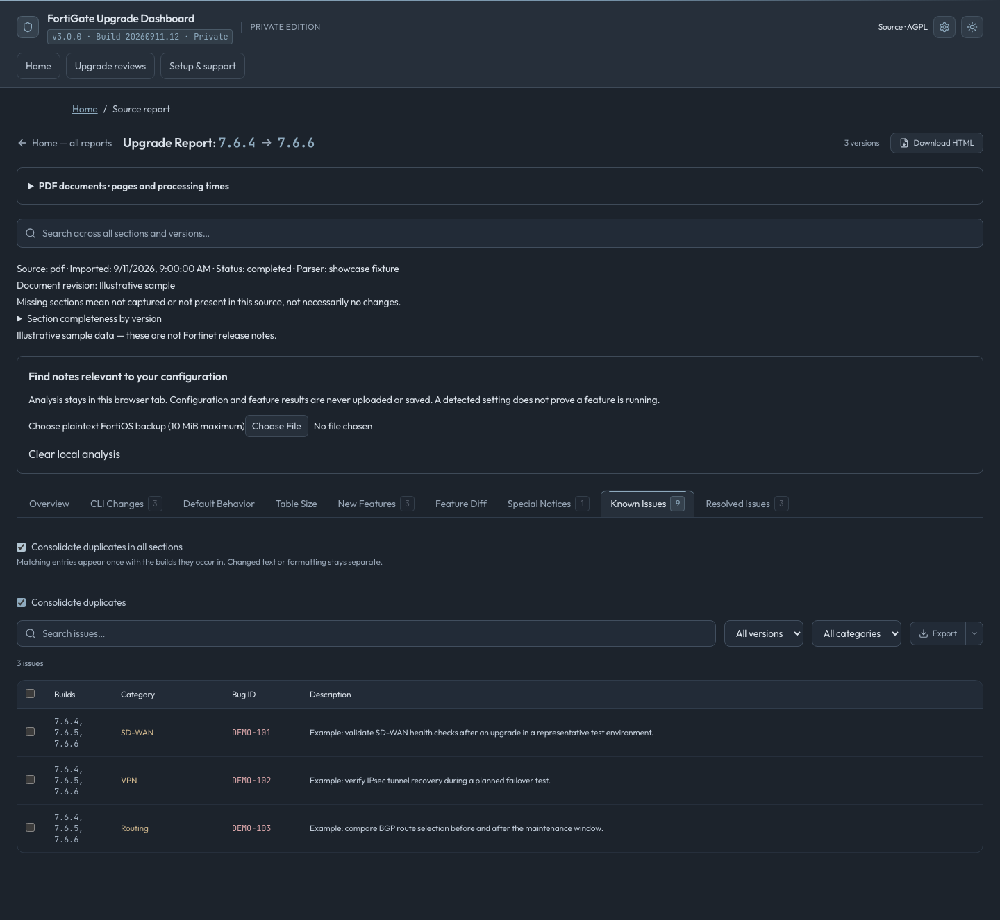
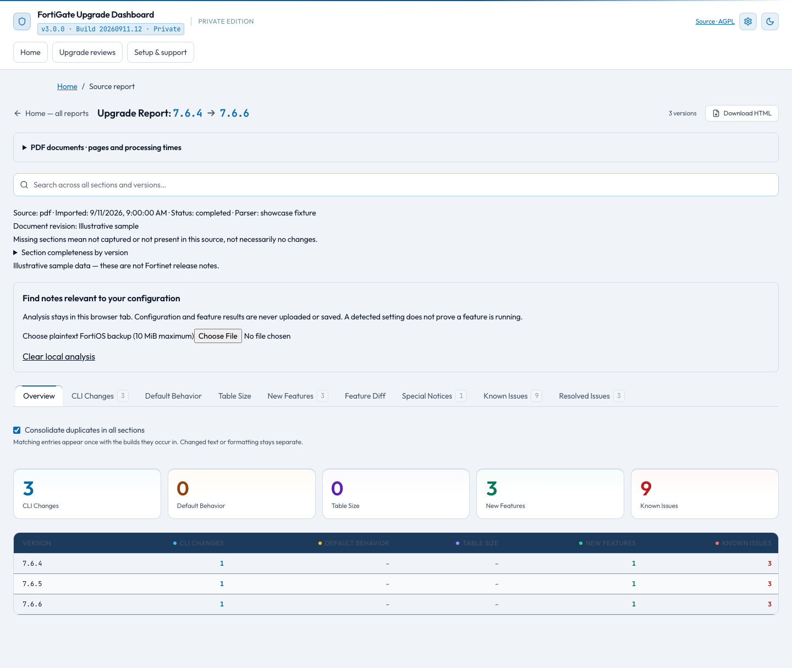
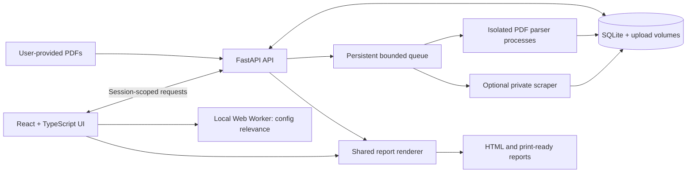

# FortiGate Upgrade Review

### Turn release notes into a structured upgrade review.

Import PDFs, compare releases, identify potentially relevant changes, and prepare a review package—with source wording kept separate from your decisions.

**[Quick start](#quick-start) · [Features](#features) · [Editions](#two-independent-editions) · [Security](#security-and-privacy) · [API](#gui-and-api) · [Documentation](#documentation)**

*Actual application UI with synthetic example notes, identifiers, and processing measurements. The screenshots do not contain Fortinet release-note content or customer data.*

## Why this project exists

An upgrade review can involve dozens of documents, repeated issues across releases, important warnings buried in prose, and notes scattered across spreadsheets. Finding a change is only the beginning: someone still needs to assess it, record a decision, and hand the result to the people carrying out the maintenance.

FortiGate Upgrade Review brings that work into one place. It turns release-note PDFs—or documentation collected by an explicitly enabled private scraper—into searchable source reports. Reviews then combine those reports with customer context, finding decisions, validation checklists, and rollback notes.

The goal is a traceable review: **what the source says, where it came from, and what the reviewer decided.**

## Who it is for

| Audience | How it helps |
| --- | --- |
| Network and security engineers | Search changes across releases, compare descriptions, and prepare focused validation tasks. |
| Firewall administrators | Collect the right release-note PDFs and follow processing progress without managing parsing scripts. |
| MSPs and consultants | Organize customers into private workspaces and combine multiple imports into a review. |
| Technical leads and change reviewers | Read attributed decisions, review completeness, and export a package for a maintenance discussion. |
| Teams with offline requirements | Import locally obtained PDFs and process them on their own Docker installation. |
| Developers and automation engineers | Use documented APIs and shared rendering tools to build the same workflows into scripts. |

This is a documentation and review tool. It does not install firmware, certify a supported upgrade path, or determine whether an upgrade is safe for a particular network.

## From documents to a review package

1. **Choose a release range.** Enter From and To versions, optionally include the starting release, and open a checklist of official PDF download links.
2. **Import your documents.** Drop in the downloaded PDFs. Follow batch progress, elapsed time, and each file's page count, duration, and outcome.
3. **Explore the source report.** Search across versions and sections, compare descriptions, and optionally consolidate identical entries.
4. **Add local configuration context.** Analyze a plaintext backup in the browser to highlight notes that may deserve attention.
5. **Record the review.** Combine report batches, save decisions and notes, and complete preparation, validation, and rollback checklists.
6. **Export the result.** Download a source report or review package; use browser printing to save a formatted PDF.

A **source report** holds imported release-note content. An **upgrade review** adds your assessment across one or more source reports. A private **workspace** controls which team members can access a customer's work.

## Features

### Searchable, source-aware reports

- Browse new features, known and resolved issues, CLI changes, default behavior, table-size changes, special notices, and additional document chapters.
- Search globally or within a section; narrow results by version and category.
- Compare releases and detect changed descriptions for shared feature IDs. Differences describe the release notes, not proof that a product feature was removed.
- Keep prose, lists, tables, code blocks, and formatting through a shared source renderer for the dashboard and HTML/print output.
- Inspect source type, import date, parser revision, document revision where available, file outcomes, warnings, and section completeness.
- Distinguish a missing or uncaptured section from a section captured with no entries. Partial imports remain visibly incomplete.

### Optional duplicate consolidation

Enable **Consolidate duplicates** for one section or **Consolidate duplicates in all sections** for the report. Identical entries appear once with the release versions in which they occur.

Consolidation is off by default and changes only the view. IDs, categories, wording, and formatting must match; changed descriptions remain separate. Rich chapters consolidate only when the entire chapter matches. Original source records remain intact, and exports respect the selected consolidation and source occurrences.

### Configuration relevance without uploading configurations

A browser Web Worker analyzes a plaintext FortiOS backup of up to **10 MiB**. It derives a small feature profile for:

**SD-WAN · IPsec VPN · SSL VPN · BGP · OSPF · HA · VDOMs · Security profiles**

The parser handles nested blocks, quoted values, VDOMs, disabled settings, and legacy/current SD-WAN syntax. Versioned, deterministic rules add **Potentially relevant** badges with matching reasons. Feature states can be corrected manually, and uncertainty remains explicit.

Raw configuration, filenames, object identifiers, and extracted profiles stay in local memory. They are not sent to the API, analytics, logs, or browser persistence. Clear the analysis or leave the page to discard it. There is no AI-provider integration or configuration-upload endpoint.

Configuration presence is not evidence of runtime use. All notes remain visible by default; relevance filtering preserves universal upgrade warnings. Exported annotations remain separate from source text.

### Reviews that retain the team's reasoning

- Combine multiple upload or scrape reports into one review.
- Save customer/site context, prepared-by details, expected versions, an executive summary, and rollback notes.
- Track findings as **Unreviewed**, **Needs testing**, **Action required**, **Not applicable**, or **Reviewed**.
- Save reviewer notes and preparation, post-upgrade, and rollback checklist items.
- Detect conflicting edits instead of silently overwriting another reviewer's changes.
- Export a review package that combines source evidence with clearly separated assessment.

Pro installations add named accounts, administrative domains backed by customer workspaces, built-in and custom permission profiles, and attributable audit history. Mark reviews complete to trigger configured email notifications; editing a completed review reopens it.

### Processing you can follow and tune

Both editions show batch elapsed time and progress, plus individual document page counts and processing durations. Completed files receive a green check; failed or interrupted files show a red X with an explanation. A file that never started is identified as not processed.

Cancel a job or retry unfinished files while retaining successful results. Queued jobs persist across restarts; interrupted attempts receive an explicit failure and retry message. Historical imports without timing measurements are labelled accordingly.

Private administrators can tune timeout, batch size, page limits, and concurrency in Settings within deployment limits. Browser-specific timeout preferences apply to new uploads and retries. Running attempts retain their submitted limits.

### Exports and everyday usability

- Download self-contained HTML with bundled fonts, or export tabular content as CSV/TXT.
- Select individual source entries for printing; save PDF using the browser's print dialog.
- Access structured JSON through the API.
- Use light or muted dark themes, consistent navigation, and visible edition/version/build identity.
- Open the original uploaded PDF and inspect provenance when validating a result.

<strong>See the light-theme version overview</strong>

*The same synthetic dataset, shown as a version overview. Example timings and counts are illustrations, not performance benchmarks.*

## Two independent editions

| Capability | Pro Docker edition | Public edition |
| --- | --- | --- |
| Intended deployment | Local machine or controlled team LAN | Operator-hosted temporary sessions |
| PDF import | Local, user-provided documents | User-provided documents |
| Storage | Persistent application and upload volumes | Session-owned reports and PDFs; 24-hour expiry |
| Identity | Named web accounts by default | Temporary visitor cookies; separate named operator login |
| Team access | Customer workspaces and role-based permissions | No shared library or cross-session access |
| Scraping | Off by default; operator may enable it | Disabled server-side |
| Selenium | Optional, trusted operator configuration | Disabled |
| Config analysis | Browser/local memory only | Browser/local memory only |
| Offline PDF workflow | Supported after installation | Hosted service requires connectivity |
| Source | Independent AGPL repository and private build | Independent AGPL repository; corresponding-source offer required |

Public cookies are not portable accounts. Clearing them loses access to the session's reports. Reports and original PDFs expire 24 hours after creation; retrying does not extend that period, and users may delete them sooner.

**Project status:** v3 includes both deployment modes and the workflows described here. Public hosting remains subject to the open security and legal release gates documented in [SECURITY.md](../SECURITY.md) and [third-party notices](../THIRD_PARTY_NOTICES.md).

### Installation administration

Both editions provide encrypted GUI/API backup and restore with validation preview, certificate upload/inspection/activation, and protected administration. Public operator backups exclude visitor reports and PDFs. Pro installations add domain metadata and read-only/archive states, custom permission profiles, local event logs, syslog, job-failure and completed-review notifications, and scheduled summary emails. SMTP starts disabled; scheduled summaries contain links and counts, not PDF attachments.

See [Administration](ADMINISTRATION.md) for setup, backup boundaries, certificate renewal responsibilities and limitations. These functions use the same authenticated APIs as the GUI. The editions are independently maintained repositories with inherited shared code; fixes must be ported deliberately.

## Quick start

Use the [edition README](../README.md) and [installation guide](../releases/PUBLIC.md) for this repository. The comparison above documents inherited capabilities; this repository ships the public edition by default.

## Security and privacy

The application enforces edition and access policy in the backend, including when accessed directly through the API.

| Area | Implemented controls |
| --- | --- |
| Access control | Session ownership for public operations; private account, workspace, and role checks. Report UUIDs are not authorization. |
| Sessions and requests | HttpOnly, SameSite cookies; Secure cookies on HTTPS; exact host/origin validation and cross-origin mutation checks. |
| Untrusted PDFs | Bounded upload/storage/page/time limits, generated stored filenames, separate parser processes, actionable invalid/encrypted-file outcomes. |
| Parser confinement | Linux Landlock and seccomp restrictions deny networking and access to other jobs; unsupported sandbox environments fail closed. Native macOS development uses Seatbelt. |
| Containers | Non-root execution, read-only root filesystem, controlled writable mounts, dropped capabilities, no privilege escalation, and memory/process limits. |
| Content rendering | Script-injection regression fixtures, bundled assets/fonts, and placeholders instead of automatic remote source-image requests. |
| Configuration privacy | Analysis and feature profiles remain local; no configuration HTTP endpoint, telemetry, or AI service. |
| Supply chain | Hash-locked Python requirements, npm lockfile, dependency audits, container scanning, and dependency/license notices. |

**Known limits are documented openly.** Container advisories remain tracked in [SECURITY.md](../SECURITY.md); passing functional tests is not a security clearance. Named accounts currently use local credentials, without SSO or MFA. Audit history is application-maintained and is not a tamper-proof compliance ledger.

Private reports and PDFs persist in local volumes, so host access and backups matter. Public deployments must avoid backups or infrastructure snapshots that retain uploaded content beyond the advertised expiry. Review the security and operations guides before exposing an installation beyond your machine.

## GUI and API

Open **Settings → API documentation (Swagger)** for the locally bundled, interactive FastAPI documentation. It works without fetching documentation assets from a CDN.

| Interface | Location | Purpose |
| --- | --- | --- |
| Swagger UI | `/api/docs` | Explore schemas and try authorized operations. |
| OpenAPI schema | `/api/openapi.json` | Generate clients and inspect request/response contracts. |
| Capabilities | `/api/capabilities` | Discover edition, version, build, and processing limits. |
| Local JavaScript module | `/assets/local-api.mjs` | Run configuration analysis, relevance rules, and report helpers locally. |

HTTP endpoints cover imports, progress, retry/cancel/delete, source files, report filters, consolidation, comparisons, exports, reviews, decisions, accounts, workspaces, audit history, and processing settings. The same authentication and edition restrictions apply to GUI and API calls.

Configuration analysis is deliberately a **local programming interface**, not a server upload. Theme and unsaved view preferences remain client state. PDF output follows the GUI workflow: export HTML, then print/save PDF in a browser; there is no server PDF-rendering endpoint.

See the [complete GUI/API map and examples](../API_GUIDE.md).

## Architecture

| Layer | Technology and responsibility |
| --- | --- |
| Interface | React 18, TypeScript, Vite, Tailwind CSS, TanStack Query, and Lucide icons. |
| API and persistence | Python 3.12, FastAPI, Pydantic, SQLAlchemy, and SQLite. |
| Document extraction | pdfplumber for structure/tables; PyMuPDF and PyMuPDF4LLM for rich document content. |
| Processing | Persistent queue with a single dispatcher per database, bounded workers, and isolated PDF subprocesses. |
| Presentation | Shared React/Markdown rendering for browser views and Node-backed HTML exports; local relevance annotations. |
| Packaging | Docker Compose, separate edition configuration, locked dependencies, and complete source/install archives. |

The design separates source content from review decisions and transient relevance annotations. Additive database migrations preserve existing reports. Polling exposes processing state without requiring a WebSocket service. See [parser design](PARSER_DESIGN.md) for extraction details and [development](DEVELOPMENT.md) for the source layout.

## Validation and engineering practices

Regression coverage includes source-to-screen/export fidelity, parser boundaries and table formatting, duplicate consolidation, session/workspace isolation, role enforcement, hostile uploads, script injection, queue recovery, retention, review conflicts, and backup/restore checks. Browser configuration fixtures exercise nested blocks, disabled and unreferenced objects, malformed input, and privacy boundaries.

The [security and regression workflow](../.github/workflows/security.yml) audits Python and npm dependencies, builds the application, scans its container, and collects license information. Scanner failures remain visible. Local checks and reproducible PDF benchmarking are described in the [development guide](DEVELOPMENT.md).

## Documentation

| Guide | Contents |
| --- | --- |
| [Private installation](../releases/PRIVATE.md) | Local Docker setup and offline deployment. |
| [Public installation](../releases/PUBLIC.md) | Temporary sessions, HTTPS, retention, and source distribution. |
| [Team installation](../TEAM_INSTALLATION.md) | First login, accounts, customer workspaces, and roles. |
| [API guide](../API_GUIDE.md) | Authentication, GUI/API mapping, exports, and local configuration tools. |
| [Operations](../OPERATIONS.md) | Backups, restoration, upgrades, rollback, and diagnostics. |
| [Development](DEVELOPMENT.md) | Source setup, tests, benchmarks, catalog maintenance, and release packaging. |
| [Parser design](PARSER_DESIGN.md) | Structure extraction and content fidelity. |
| [Security](../SECURITY.md) | Threat boundaries, known findings, and remaining release gates. |
| [Third-party notices](../THIRD_PARTY_NOTICES.md) | Dependency licenses, source obligations, and document considerations. |

## Contributing

Issues and pull requests are welcome. For a parsing problem, include the release version, document revision, affected section, and expected versus observed behavior. Use a minimal synthetic fixture or a source reference when possible; keep confidential configurations, credentials, customer information, and documents you cannot redistribute out of public issues.

Keep changes focused, preserve source wording and formatting, and run the relevant checks in the [development guide](DEVELOPMENT.md). Historical `v#` directories are retained as legacy versions and should remain untouched.

## License and attribution

This project is licensed under **GNU AGPL v3 or later**. See [LICENSE](../LICENSE) and [THIRD_PARTY_NOTICES.md](../THIRD_PARTY_NOTICES.md) for the applicable terms and dependency notices. Distribution and hosted deployments must provide the required corresponding source; PyMuPDF and PyMuPDF4LLM have AGPL/commercial licensing options.

FortiGate, FortiOS, and Fortinet are trademarks of their respective owners. This is an independent project and is not affiliated with or endorsed by Fortinet. Vendor documentation retains its original copyright and terms. Uploading a PDF does not grant redistribution rights; complete the documented legal review before a public launch.
